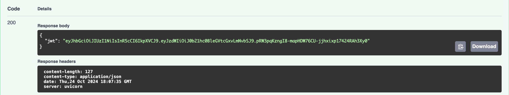
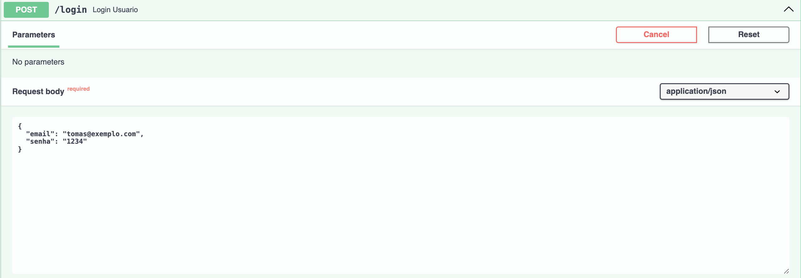

# Projeto de cloud

## Autor do repositório:
Tomas Rolim Miele

## Explicação do Projeto
Esse projeto consiste na criação de uma API RESTfull 
com a implementação de 3 endpoints. O primeiro sendo
o registro de um novo usuário, o segundo o login deste
usuário e por fim uma consulta sobre as últimas atualizações de uma ação de sua escolha, caso não seja
passada nenhuma ação o endpoint coletará essas informações
sobre a ação da Apple (AAPL).

## Explicação de Como Executar a Aplicação

### Baixando o repositório:
1. Clone o repositório:  

Copie o linke a baixo e cole-o no terminal de seu computador e execute o comando. (Sugestão: antes de clonar o repositório entre no diretório do Downloads ou Desktop).
>https://github.com/tomasmiele/cloud-projeto.git

2. Entre no repositório:  

Para isso, ainda no terminal execute o comando:

>```bash
>cd cloud-projeto
>```

3. Rodar a aplicação:

Abra o aplicativo do Docker e deixe-o rodando, feito isso execute no terminal, dentro da pasta que acabamos de entrar, o comando:

>```bash
>docker compose up 
>```

4. Teste dos endpoints:

Mais adiante explicarei detalhadamente cada endpoint, ou seja, o que você deve passar como parâmetro para eles e o que esperar como retorno.

Para acessá-los entre em um browser, como o Google Chrome, e coloque esse link:

>http://localhost:8000/docs

Pronto! A aplicação está pronta para uso.

### Baixando apenas o Compose:
1. Baixe o arquivo compose.yaml

(Sugestão: antes de baixar o arquivo entre no diretório do Downloads ou Desktop)

<a href="files/compose.yaml" download>Baixar Compose</a>

2. Rodar a aplicação:

Abra o aplicativo do Docker e deixe-o rodando, feito isso abra o terminal da sua máquina (caso tenha clonado em uma pasta específica entre nela) e execute o comando:

>```bash
>docker compose up 
>```

3. Teste dos endpoints:

Como dito, mais adiante explicarei detalhadamente cada endpoint, ou seja, o que você deve passar como parâmetro para eles e o que esperar como retorno.

Para acessá-los entre em um browser, como o Google Chrome, e coloque esse link:

>http://localhost:8000/docs

Pronto! A aplicação está pronta para uso.

## Documentação dos Endpoints 
### POST: "/registrar"
Cria um novo usuário no sistema. Gera um token JWT para o usuário registrado.

#### Parâmetros de entrada:

- nome (string): Nome do usuário. (Obrigatório)
- email (string): Email do usuário. (Obrigatório)
- senha (string): Senha do usuário. (Obrigatório)


#### Respostas:

200 OK: Usuário registrado com sucesso. Retorna o token JWT.
> ```json
> {"jwt": "token_jwt_gerado"}
> ```


409 Conflict: Email já registrado
> ```json
> {"detail": "Email já registrado."}
> ```


#### Exemplo de Requisição

> ```json
> {
>  "nome": "Humbeerto Sandmann",
>   "email": "humberto@example.com",
>   "senha": "senha123"
> }
> ```

### POST: "/login"
Autentica o usuário com email e senha. Gera um token JWT para o usuário autenticado.

#### Parâmetros de entrada:

- email (string): Email do usuário. (Obrigatório)
- senha (string): Senha do usuário. (Obrigatório)



#### Respostas:

200 OK: Login bem-sucedido. Retorna o token JWT.
> ```json
>{"jwt": "token_jwt_gerado"}
>```


401 Unauthorized: Email não registrado ou senha incorreta.
> ```json
> {"detail": "Email não registrado."}
> ```  

ou
> ```json
> {"detail": "Senha incorreta."}
> ```


#### Exemplo de Requisição

> ```json
> {
>   "email": "humberto@example.com",
>   "senha": "senha123"
> }
> ```

### GET: "/consultar"
Consulta as informações diárias de uma ação especificada. Retorna os dados dos últimos 5 dias.

#### Parâmetros de entrada:

- acao (query parameter): Símbolo da ação a ser consultada. Caso não seja passado nada nenhum parâmetro ele assume a ação da Apple (AAPL) como padrão.
- Autenticação: O usuário precisa estar autenticado com um token JWT válido.


#### Respostas:

200 OK:  Retorna as informações dos últimos 5 dias da ação especificada ou a padrão.
> ```json
> {  
>  "Informações dos últimos 5 dias da Ação: AAPL": {  
>          "1. open": { ... },  
>          "2. high": { ... },  
>          "3. low": { ... },  
>          "4. close": { ... },  
>          "5. volume": { ... }  
>  }   
> }
> ```


203 Forbidden: Token não autenticado.
>``` json
>{"detail": "Not authenticated"}
>```


204 No Content: Ação não encontrada.
> ``` json
>{"detail": "Não existe essa ação."}
> ```


Exemplo de Requisição
> ```bash
>GET /consultar?acao=AAPL
> ```

## Vídeo de Execução da Aplicação

## Docker Hub
https://hub.docker.com/repository/docker/tomasmiele/cloud-projeto/general

## Código do docker-compose.yaml
### Download:

<a href="files/compose.yaml" download>Baixar Compose</a>

### Copiar Arquivo:
> ```
>services:
>  db:
>    image: postgres:15
>    container_name: postgres_container
>    environment:
>      - POSTGRES_USER=${POSTGRES_USER:-projeto}
>      - POSTGRES_PASSWORD=${POSTGRES_PASSWORD:-projeto}
>      - POSTGRES_DB=${POSTGRES_DB:-projeto}
>    ports:
>      - "5432:5432"
>
>  app:
>    image: tomasmiele/cloud-projeto:latest
>    container_name: fastapi_app
>    environment:
>      - POSTGRES_USER=${POSTGRES_USER:-projeto}
>      - POSTGRES_PASSWORD=${POSTGRES_PASSWORD:-projeto}
>      - POSTGRES_DB=${POSTGRES_DB:-projeto}
>      - DB_HOST=db
>      - DB_PORT=5432
>      - SECRET_KEY=${SECRET_KEY}
>      - API_KEY=${API_KEY:-H456ZLCOCHH7CH10}
>    ports:
>      - "8000:8000"
>    depends_on:
>      - db
> ```